# Hi there! I'm Marcela Aristizabal-Julio 👋

Data Analyst with a **Biomedical Engineering** background and experience building healthcare technology solutions. I specialize in creating tools that bridge clinical needs with technical implementation.

## 🔗 Connect with me
[](mailto:aristizabal.marcelasofia@gmail.com)
[](https://linkedin.com/in/marcela-aristizábal-julio-3a71281bb)

---

## 🚀 About Me
* 🎓 **BSc in Biomedical Engineering** at Universidad CES (2020 - 2025).
* 🐍 Focused on data processing and automation in clinical environments.
* 📱 Experienced in mobile development for clinical applications.
* 📊 Passionate about data science and healthcare analytics.

---

## 🛠️ Tech Stack

### Languages & Frameworks


### Data & Tools


---

## 📊 Career Path

```mermaid
graph TD
    A[Biomedical Engineering Background] --> B(Health Tech Developer - Clínica CES)
    B --> C{Internship - Hospital San Vicente Fundación}
    C --> D[Python & Data Automation]
    C --> E[Clinical Decision Support]
    D --> F[Junior Data Analyst Role]
    E --> F
```



---

## 🌟 Key Projects

* **ULCES App:** Developed a mobile application using Flutter and Firebase for real-time tracking of pressure ulcers in ICUs at Clinica CES. 


* **Predictive Healthcare Models:** Created early diagnosis models using Python (Scikit-learn) on real-world healthcare datasets. 


* **Clinical Data Automation:** Automated monthly clinical performance data collection and integrated multiple hospital systems. 


---

## 📜 Certifications

* **Python for Everybody Specialization** - University of Michigan. 


* **IBM Data Science Professional Certificate** (In Progress). 


* **Effective Problem Solving and Decision Making** - University of California Irvine. 


```

```
